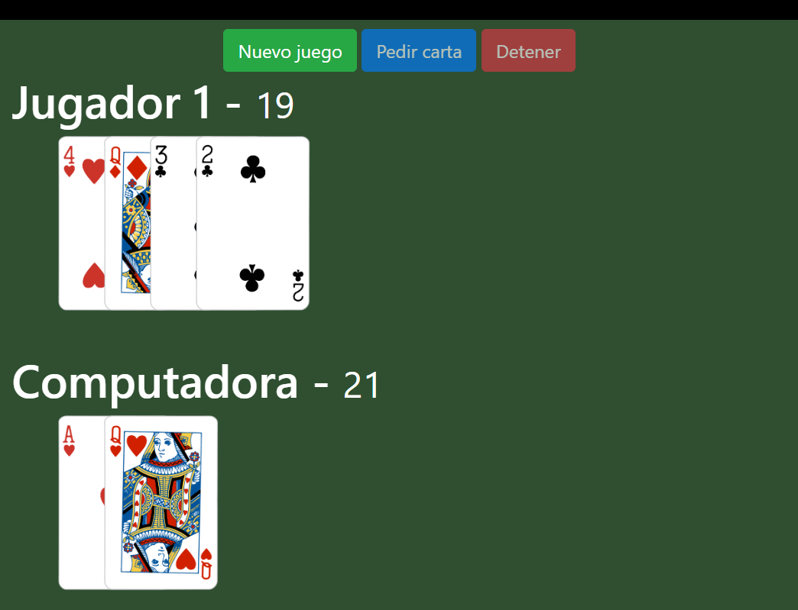
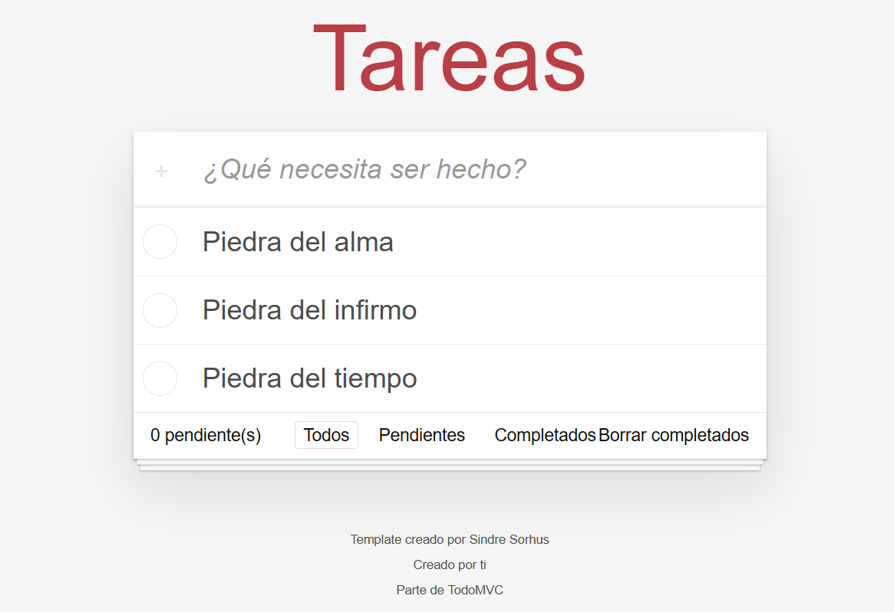
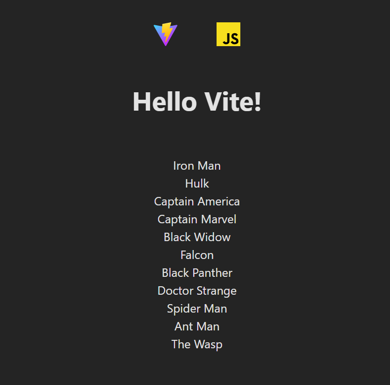

# Javascript

## Javascript course

This is a course follow the materia created by Fernando Herrera in his course Javascript in DevTalles

## Blackjack game



## Vite
```
npm create vite         # Create app vite
npm run dev             # run app
npm run build           # create app's dist
```

# Todo app




# Advanced



# Crud App
```
npm run server  # run json-server
```